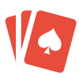

<p align="center">
  
</p>

<h1 align="center">Otto</h1>
<p align="center"><strong>Uno Multiplayer</strong> — Jogo de cartas em tempo real</p>

<p align="center">
  <a href="http://localhost:3000"><strong>🎮 JOGAR</strong></a>
</p>

<p align="center">
  
  
  
  
</p>

---

## Como Jogar

1. Acesse a sala com o codigo de **6 digitos**
2. Compartilhe com seus amigos (ate 15 jogadores)
3. O host clica em **Iniciar Partida**

### Regras Basicas

Jogue uma carta que combine por **cor**, **numero** ou **tipo** com a carta do topo. Primeiro a ficar sem cartas na mao **vence**.

| Carta | Efeito |
|-------|--------|
| **Pular** | Proximo jogador perde a vez |
| **Inverter** | Inverte o sentido do jogo (2 jogadores = Pular) |
| **+2** | Proximo compra 2 cartas e perde a vez |
| **Curinga** | Escolha uma nova cor |
| **+4** | Escolha cor e o proximo compra 4 cartas |

### UNO!

Com **2 cartas** na mao, declare **UNO** antes de jogar a penultima! Se jogar sem declarar: **+2 cartas** de penalidade.

### Empilhamento

Cartas do mesmo tipo podem ser empilhadas:

| Carta | Empilha com | Penalidade se nao empilhar |
|-------|-------------|---------------------------|
| +2 | +2 | Compra acumulado |
| +4 | +4 | Compra acumulado |
| Pular | Pular | Pula acumulado |
| Curinga | Curinga | Escolhe cor e passa |
| Inverter | Inverter | Inverte direcao |

### Timer

**15 segundos** por turno. Se o tempo acabar, compra 1 carta automatico e passa a vez.

---

## Como Rodar

```bash
npm install
npm run dev
```

Abra `http://localhost:3000` em duas abas. Crie uma sala em uma, entre com o codigo na outra.

---

<p align="center">
  Feito com ♥️
</p>
